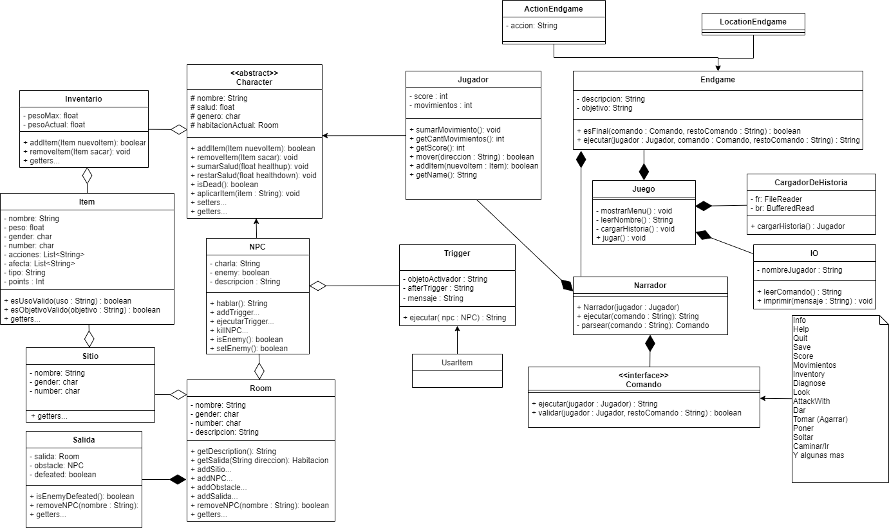

# Zork

## Introducción

Se trata de un proyecto para el taller de calificación profesional de la materia
*programación avanzada* de la **Universidad de la Matanza**. [Zork][1] es un
juego de ficción interactiva. En este proyecto se busca crear una versión del
mismo en Java.  

Se pueden encontrar las consignas [aquí][2]

[1]: https://es.wikipedia.org/wiki/Zork
[2]: https://github.com/programacion-avanzada/2020a/tree/master/consigna

## Actual diagrama de clases

## Qué hacer

Tenemos las siguientes clases a implementar. En orden de implementación:

1. ~Items~.
2. ~Inventario~.
3. ~Personaje~.
    1. ~NPC~
    2. ~Jugador~
4. ~Sitio.~
5. ~Room.~
7. ~IO.~
8. Comandos.
    1. ~Info~
    2. Ayuda
    3. Salir
    4. Guardar
    5. ~Puntuacion~
    6. ~Movimientos~
    7. ~Inventario~
    8. ~Diagnostico~
    9.	Mirar
    10. ~AtacarCon~
    11. Dar
    12. ~Tomar(agarrar)~
    13. ~Poner~
    14. Soltar
    15. ~Caminar/Ir~
    16. etc.
9. Narrador.
10. CargadorDeHistoria.
11. Juego.

